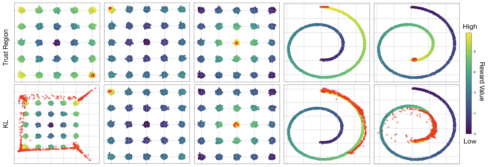

##  Diffusion Trusted Q-Learning for Offline RL &mdash; Official PyTorch Implementation

**Diffusion Policies creating a Trust Region for Offline Reinforcement Learning**<br>
Tianyu Chen, Zhendong Wang, and Mingyuan Zhou <br> 
<br>

Abstract: *Offline reinforcement learning (RL) leverages pre-collected 
datasets to train optimal policies. Diffusion Q-Learning (DQL), introducing 
diffusion models as a powerful and expressive policy class, significantly 
boosts the performance of offline RL. However, its reliance on iterative 
denoising sampling to generate actions slows down both training and 
inference. While several recent attempts have tried to accelerate 
diffusion-QL, the improvement in training and/or inference speed often 
results in degraded performance. In this paper, we introduce a dual 
policy approach, Diffusion Trusted Q-Learning (DTQL), which comprises a 
diffusion policy for pure behavior cloning and a practical one-step policy. 
We bridge the two polices by a newly introduced diffusion trust region 
loss. The diffusion policy maintains expressiveness, while the trust 
region loss directs the one-step policy to explore freely and seek 
modes within the region defined by the diffusion policy. DTQL 
eliminates the need for iterative denoising sampling during both training 
and inference, making it remarkably computationally efficient. We 
evaluate its effectiveness and algorithmic characteristics against 
popular Kullback-Leibler (KL) based distillation methods in 2D bandit 
scenarios and gym tasks. We then show that DTQL could not only outperform 
other methods on the majority of the D4RL benchmark tasks but also 
demonstrate efficiency in training and inference speeds.*

## Introduction

We introduce a dual-policy approach, Diffusion Trusted Q-Learning (DTQL): a diffusion policy for pure behavior cloning and a one-step policy for actual depolyment. 
We bridge the two policies through our newly introduced diffusion trust region loss. 
The loss ensures that the generated action lies within the in-sample datasets' action manifold. 
With the gradient of the Q-function, it allows actions to freely move within the in-sample data manifold and gravitate towards high-reward regions. 

We compare our behaviour regularization loss (diffusion trusted region loss) with Kullback–Leibler based behaviour regularization loss. We tested their differential impact on behavior regularization, using a trained Q-function for policy improvement. Red points represent actions generated from the one-step policy.




## Experiments

### Requirements
Installations of [PyTorch](https://pytorch.org/), [MuJoCo](https://github.com/deepmind/mujoco), and [D4RL](https://github.com/Farama-Foundation/D4RL) are needed. Please see the ``requirements.txt`` and ``install_env.sh`` for environment set up details.

### Running
Running experiments based our code could be quite easy, so below we use `halfcheetah-medium-v2` dataset as an example. 

```.bash
python main.py --device=0 --env_name=halfcheetah-medium-v2 --seed=1 --dir=results
```

Hyperparameters for Diffusion-QL have been hard coded in `main.py` for easily reproducing our reported results. 
Definitely, there could exist better hyperparameter settings. Feel free to have your own modifications. 

## Citation

If you find this open source release useful, please cite in your paper:
```

```

## Acknowledgement
This repo is heavily built upon [DQL](https://github.com/Zhendong-Wang/Diffusion-Policies-for-Offline-RL). We thank the authors for their excellent work.